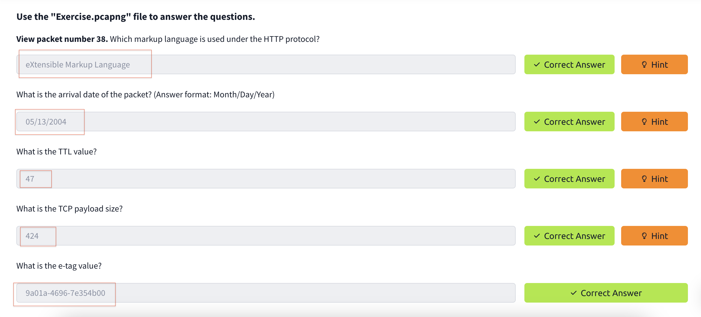
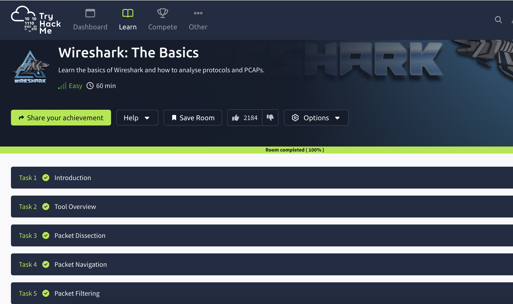

# Wireshark

I have completed the Wireshark course from TryHackMe. I learned about traffic sniffing, packet dissection, packet navigation, and packet filtering.
Wireshark is an open-source, cross-platform tool designed for analyzing network packets. It enables users to monitor live traffic and review packet captures (PCAP), making it one of the leading tools for packet analysis.

## Task2-1

## Task2–2

## Task2–3

## Task2 Correct Answer

## Task3–1

## Task3–2

## Task3–3

## Task3–4

## Task3–5

## Task3 Correct Answer

## Task4–1

## Task4–2

## Task4–3

## Task4–4

## Task4 Correct Answer

## Task5–1

## Task5–2

## Task5–3

## Task5–4

## Task5 Correct Answer

## All Task Completed

